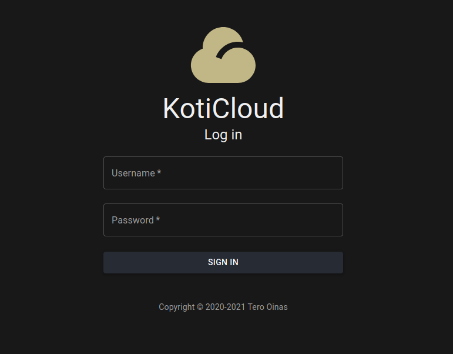

## Introduction ##

KotiCloud is a file / cloud storage server, currently heavily work-in-progress.

At this time it might be usable as a personal file server in a safe environment. It can be used through a web interface or a command line client. You can upload, download, copy, move, rename and delete files, edit text files, read PDFs, watch videos, listen to audio files and look at images.

## Requirements ##

Go 1.16, node.js, yarn, docker, docker-compose and make.

## Building a demo image ##

You can build a docker demo image by typing:

> make demo

This command builds two docker images: "koticloud" for the application and "koticloud_db" for the supporting PostgreSQL database. To get the system up, you can use docker-compose:

> docker-compose up

The server can then be reached using http://localhost:7080

Use "admin" as username and password.

## Third party software and assets ##

- React [https://reactjs.org]
- Material-UI [https://material-ui.com]
- mui-rte [https://github.com/niuware/mui-rte] which uses draftjs [https://draftjs.org/]
- React-pdf [https://react-pdf.org/]
- Icons are from RemixIcons [https://remixicon.com]

## TODO ##

Many many things to do. User management, file sharing, support for more file types, bookmark manager, bug fixes, etc...
